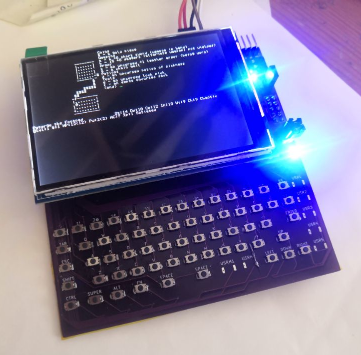
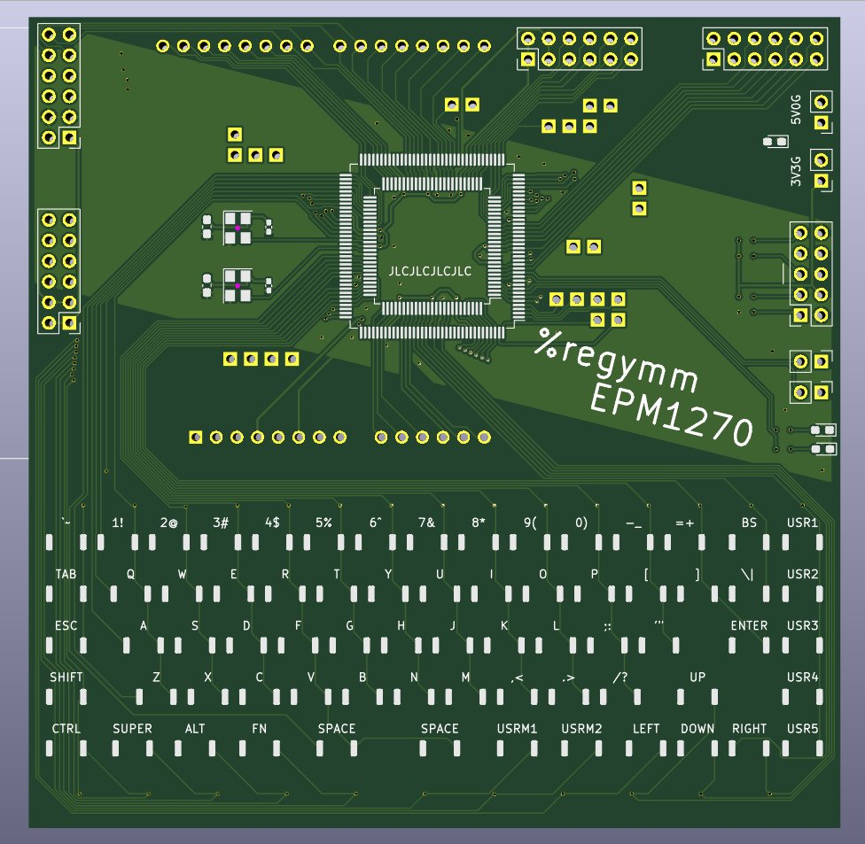

## YMMEPM

#### CPLD Dev Board & Handheld Serial Terminal

Board with Altera MAX II EPM1270. With a pluggable 480x320 LCD screen and a matrix keyboard, it work well as a handheld serial terminal. [Video](https://t.me/petergulife/174). 

**Gallery**

**The terminal**

`rtl/lcd_terminal.v`

Due to the scares resource of the EPM1270, the terminal supports only basic cursor movement and clear VT100(`^[[X`) sequences, others are detected and ignored. Have to put character pixel lists into slow UFM, so only up to 19200 baud rate. In case of Linux, bash and commands like `ls` work. `nano` won't display correctly and the editor that works is `ed` or my [ymedit](https://github.com/regymm/ymedit). CTS flow control is utilized to avoid losing chars when clearing full screen. (so need to connect 5 wires to use: 5V0, GND, rx, tx, cts)

**The keyboard**

`rtl/uart_keyboard.v`

Currently support only single-byte chars, arrow keys won't work. In code UP and RIGHT are used as extra SHIFT and CTRL. 

Covering keyboard with high-temperature yellow tape will significantly improve type feeling. 

**Design**

Simple is the main concern ... or not?

Single 3V3, or single 5V0 with ASM1117 to 3V3. 

Right two PMODs directly connected to CPLD. Left 2 PMODs share the Arduino pins(these literally give the plugged LCD screen a PMOD interface). Spare IOs scattered here and there. 

1 power LED, 2 user LEDs, 2 user jumpers. 2 oscillators. A strange matrix keyboard. 

For the simplest verification, only the CPLD, power pins, and JTAG pins are needed. Even caps on the back can be left empty. 

Footprint is compatible with EPM1270/570/240 TQFP144/100, but certainly the full terminal can only fit into EPM1270(~ 90% logic elements used). 

**Bugs**

5V is not connected to the Arduino pin. Fly a wire from ASM1117 if using 5V LCD screen. 

JTAG header pins should be soldered on back of the board. 

Still some tiny problems in the supported VT100 controls. But if the fix is paid in extra logic elements, I have to consider. 